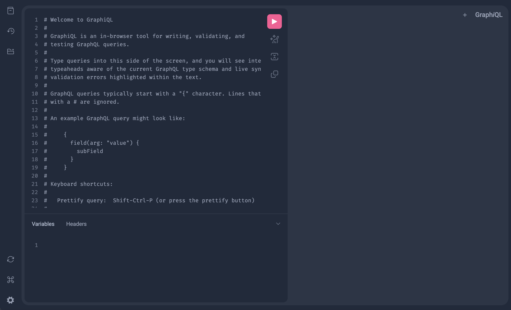
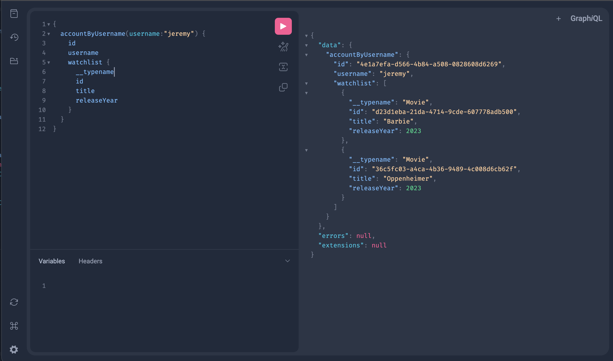

# FastGQL

FastGQL is a python GraphQL library that uses Pydantic models to build GraphQL types. Think FastAPI for GraphQL.

```py
from fastapi import FastAPI
from fastgql import GQL, build_router

class User(GQL):
    name: str
    age: int

class Query(GQL):
    def user_by_name(self, name: str) -> User:
        return User(name=name, age=27)

router = build_router(query_models=[Query])

app = FastAPI()

app.include_router(router, prefix="/graphql")
```

## Installation

<div class="termy">

```console
$ pip install fastgql
---> 100%
Successfully installed fastgql
```

</div>

## Example

All you need to do is create objects that inherit from `fastgql.GQL`, which is a simple subclass of `pydantic.BaseModel`. For this example, I am creating a mock schema based on movies. For the functions, you'd usually use a database but I hardcoded the data for this example.

This code generates a GraphQL schema, reading the object fields and functions. Functions can be sync or async.

### Code it

- Create a file `main.py` with:

```py title="main.py"
from uuid import UUID, uuid4
from fastapi import FastAPI
from fastgql import GQL, build_router

class Account(GQL):  # (4)!
    id: UUID
    username: str

    def watchlist(self) -> list["Movie"]:  # (1)!
        # Usually you'd use a database to get the user's watchlist. For this example, it is hardcoded.
        return [
            Movie(id=uuid4(), title="Barbie", release_year=2023),
            Movie(id=uuid4(), title="Oppenheimer", release_year=2023),
        ]

    def _secret_function(self) -> str:  # (2)!
        return "this is not exposed!"

class Person(GQL):
    id: UUID
    name: str

    def filmography(self) -> list["Movie"]:
        return [
            Movie(id=uuid4(), title="Barbie", release_year=2023),
            Movie(id=uuid4(), title="Wolf of Wallstreet", release_year=2013),
        ]

class Movie(GQL):
    id: UUID
    title: str
    release_year: int

    def actors(self) -> list["Person"]:
        return [
            Person(id=uuid4(), name="Margot Robbie"),
            Person(id=uuid4(), name="Ryan Gosling"),
        ]

class Query(GQL):
    def account_by_username(self, username: str) -> Account:  # (5)!
        # Usually you'd use a database to get this account. For this example, it is hardcoded.
        return Account(id=uuid4(), username=username)

router = build_router(query_models=[Query])

app = FastAPI()  # (3)!

app.include_router(router, prefix="/graphql")
```

1. Usually this would be a database call. There is an advanced tutorial showing this.
2. Functions that start with `_` are not included in the GraphQL schema.
3. This is just a normal FastAPI app. `fastgql.build_router` returns a router that can be included on any FastAPI app.
4. These objects are subclasses of `pydantic.BaseModel`, so anything you'd want to do with a `BaseModel` you can do with these. You'll see how this comes in handy in future tutorials.
5. All of these functions can be sync or async. In a future tutorial I'll use an async database call to get data.

### Run it

Run the server with:

<div class="termy">

```console
$ uvicorn main:app --reload

INFO:     Uvicorn running on http://127.0.0.1:8000 (Press CTRL+C to quit)
INFO:     Started reloader process [28720]
INFO:     Started server process [28722]
INFO:     Waiting for application startup.
INFO:     Application startup complete.
```

</div>

<details markdown="1">
<summary>(Taken from FastAPI docs) About the command <code>uvicorn main:app --reload</code>...</summary>

The command `uvicorn main:app` refers to:

- `main`: the file `main.py` (the Python "module").
- `app`: the object created inside of `main.py` with the line `app = FastAPI()`.
- `--reload`: make the server restart after code changes. Only do this for development.

</details>

### Check it

Open your browser at <a href="http://127.0.0.1:8000/graphql" class="external-link" target="_blank">http://127.0.0.1:8000/graphql</a>.

You will see a GraphiQL UI. This is your homebase for creating GraphQL queries and checking the schema.



You can see the schema, build queries, and access query history from the icons in the top left respectivly. Here is an example query:


