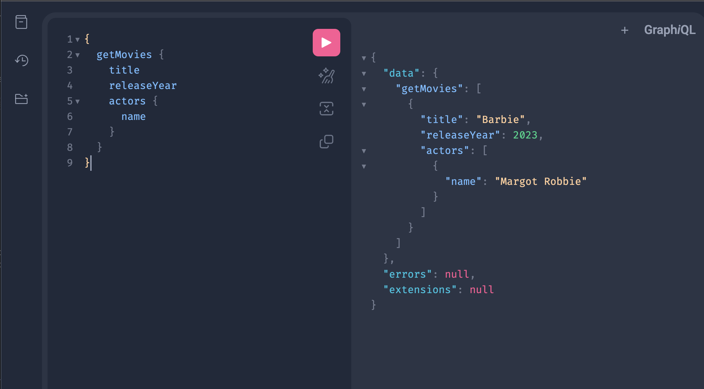

# Intro, Installation, and First Steps

This tutorial assumes you know the basics of GraphQL. If you don't, I suggest checking out this great [tutorial](https://graphql.org/learn/) first.

### Create a project and install FastGQL

Create a folder:

```bash
mkdir fastgql-tutorial
cd fastgql-tutorial
```

Now, we'll create a virtual environment. This allows us to install python libraries scoped to this project.

First, ensure you have a python version of 3.10 or greater. You can check this by running:

```
python --version
```

If you do not have python 3.10 or greater, install that now.

```bash
python -m venv virtualenv
```

Now we need to activate the virtual environment.

```bash
source virtualenv/bin/activate
```

Now we can install **FastGQL**:

```bash
pip install fastgql
```

**FastGQL** installs with [**FastAPI**](https://fastapi.tiangolo.com/) and [**Pydantic V2**](https://docs.pydantic.dev/latest/). You will not need to install a seperate web server library.

### Define the Schema

!!! info
    For the sake of simplicity, all code in for this tutorial will be in one file.

<details>
<summary>Full file 👀</summary>

```Python
{!./docs_src/tutorial/movie_super_simple.py!}
```

</details>

**FastGQL** works by reading objects inheriting from `fastgql.GQL` and constructing a GraphQL schema. It reads both the fields and functions of the object. `GQL` is a simple subclass of `pydantic.BaseModel` and has all of the functionality of a `BaseModel`.

Even the root `Query` is a `GQL` type.

Create the file `schema.py`:

```python title="schema.py"
from fastapi import FastAPI
from fastgql import GQL, build_router

class Actor(GQL):
    name: str

class Movie(GQL):
    title: str
    release_year: int
    actors: list[Actor]

class Query(GQL):
    def get_movies(self) -> list[Movie]:
        return [
            Movie(
                title="Barbie",
                release_year=2023,
                actors=[Actor(name="Margot Robbie")],
            )
        ]
```

### Build our schema and run it

Under the hood, **FastGQL** creates a **FastAPI** router that executes incoming GraphQL queries. If you're unfamiliar with **FastAPI**, it is worth checking out their excellent [docs](https://fastapi.tiangolo.com/).

```python title="schema.py"
router = build_router(query_models=[Query]) # (1)!

app = FastAPI() # (2)!

app.include_router(router, prefix="/graphql") # (3)!
```

1. This is where we build the **FastAPI** router with our schema
2. Initialize a new FastAPI instance for your app. This can be any app, including one already created elsewhere.
3. Attach the router to the app and include whatever prefix you'd like the GraphQL endpoint to be reached at.

<details>
<summary>👀 Full file preview</summary>

```Python
{!./docs_src/tutorial/movie_super_simple.py!}
```

</details>

The easiest way to run this **FastAPI** server is with [**Uvicorn**](https://www.uvicorn.org/), which is a fast async web server.

```bash
uvicorn schema:app --reload # (1)!
```

1. A good explaination of **Uvicorn** can be found [here](https://fastapi.tiangolo.com/#run-it).

### Query it

It is time to execute your first query! Go to `http://0.0.0.0:8000/graphql` where you should see a GUI for GraphQL called GraphiQL.


Paste this query into the text box and hit the play button:

```graphql
{
  getMovies {
    title
    releaseYear
    actors {
      name
    }
  }
}
```

You should see the data we made in `schema.py` come back 🎉



Now, we will move on to more advanced tutorials!